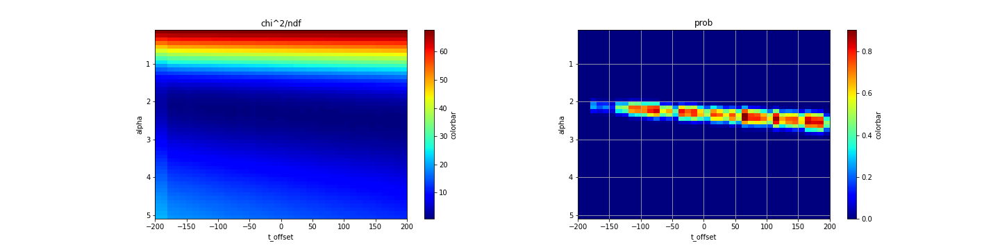
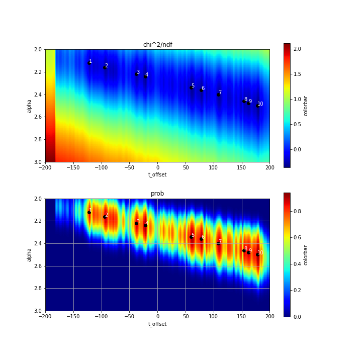
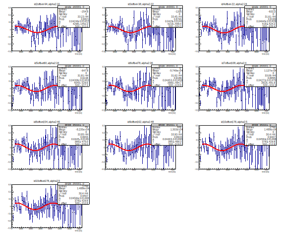
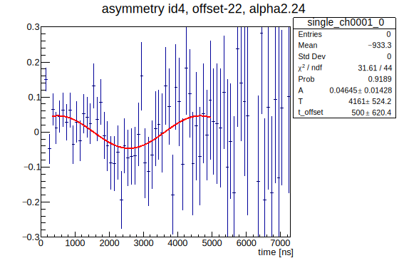
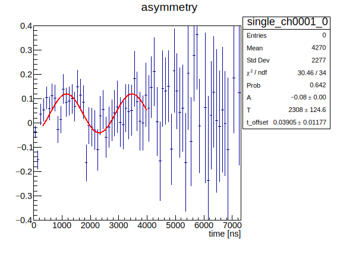

# パラメータの探索とフィッテイング

発表スライドに載せたラーモア振動とは異なったフィッティングがあり得ると思いました．
方法を整理したので，どちらが良いか判断したいです．
クリティカルな違いは，t=0での三角関数が正に振れることを仮定するか，負に振れることを仮定するかなのではないかと思います．

## BGの決定

4013.rootのch0, ch1についてはじめにバックグラウンドを決定する．
各チャンネルのヒストグラムについて，

```root:getslice_func.C
TF1 *f1 = new TF1("f1", "[ 0 ] * exp( -(x / [ 1 ]) + [ 2 ]) +  [ 3 ] ");
```
でフィッティングしてBG値[3]を決定する．以下の解析ではbin幅は常に100にしている．

<details><summary>フィッティングのコード</summary><div>

```root:getslice.C
void getslice4013( int tekitou = 1 ){
    gStyle->SetOptStat(1111);
    gStyle->SetOptFit(1111);
    gStyle->SetFuncWidth(2);

    const char *fp = "4013.root";
    TFile *file = new  TFile(fp);
    TH1D* h1;
    TH1D* h2;
    file->GetObject("single_ch0000_0", h1);
    file->GetObject("single_ch0001_0", h2);
    
    TCanvas *c1= new TCanvas("c1","c1", 600, 600 );
    h1->Rebin(100);
    h2->Rebin(100);

    TF1 *f1 = new TF1("f1", "[ 0 ] * exp( -(x / [ 1 ]) + [ 2 ]) +  [ 3 ] ");
    TF1 *f2 = new TF1("f2", "[ 0 ] * exp( -(x / [ 1 ]) + [ 2 ]) +  [ 3 ] ");
    f1->SetParameters( 200.0, 2000.0, 0.0, 0.0);
    f1->SetParNames("a", "b", "c", "d");
    f2->SetParameters( 100.0, 2000.0, 0.0, 0.0);
    f2->SetParNames("e", "f", "g", "h");
    // TF1 *f1 = new TF1("f1", "[ 0 ] * x + [ 1 ]");
    h1->Fit("f1", "", "", 300, 22000);
    h1->SetLineWidth(2.0);
    h2->Fit("f2", "", "", 300, 22000);
    h2->SetLineWidth(2.0);

   
    h2->Draw();
    h2->SetLineColor(kRed);
    // h2->SetFillColor(10);
    h2->GetXaxis()->SetRangeUser(0,25000);
    h2->GetYaxis()->SetRangeUser(0.9,500);
    h1->Draw("same");
    h1->GetXaxis()->SetRangeUser(0,25000);
    h1->GetYaxis()->SetRangeUser(0.9,500);
    c1->SetLogy();
}
   
```
</div></details>

結果
```dat:fitting_result.dat
 FCN=212.382 FROM HESSE     STATUS=NOT POSDEF     23 CALLS         136 TOTAL
                     EDM=2.47072e-08    STRATEGY= 1      ERR MATRIX NOT POS-DEF
  EXT PARAMETER                APPROXIMATE        STEP         FIRST   
  NO.   NAME      VALUE            ERROR          SIZE      DERIVATIVE 
   1  a            1.88778e+02   2.84895e+01   3.05847e-03   9.07766e-05
   2  b            2.06733e+03   3.10616e+01   2.52021e-02   5.35559e-06
   3  c            8.99819e-01   1.50918e-01   1.62001e-05   1.71367e-02
   4  d            6.45973e+00   2.47303e-01   3.15705e-04  -1.95236e-04
 FCN=237.512 FROM HESSE     STATUS=NOT POSDEF     23 CALLS         144 TOTAL
                     EDM=3.29172e-09    STRATEGY= 1      ERR MATRIX NOT POS-DEF
  EXT PARAMETER                APPROXIMATE        STEP         FIRST   
  NO.   NAME      VALUE            ERROR          SIZE      DERIVATIVE 
   1  e            8.75155e+01   2.04326e+01   2.34535e-03   2.43179e-05
   2  f            1.98974e+03   5.44044e+01   8.75240e-03   6.74790e-08
   3  g            9.01006e-01   2.33481e-01   2.67990e-05   2.12827e-03
   4  h            8.41336e+00   2.65980e-01   3.51129e-04   1.54197e-04
```

d, hが各々ch0, ch1の[3]に対応する．
ch0のBGは6.45973，ch1のBGは8.41336と決定した．

## 08/28からの変更点

### フィッティング関数

08/28の時は，フィッティング関数に縦軸方向のオフセットを入れていた．
```root:fitting1.C
TF1 *f4 = new TF1("f4", "[0]*cos(2*TMath::Pi()*x/[1]) + [2]");
```
けれど，本来アシンメトリーは縦軸方向にオフセットのない三角関数になるべきなので，縦軸方向のオフセットを無くしました．
ついで，時間方向のオフセットを入れました．


```root:fitting2.C
TF1 *f4 = new TF1("f4", "[0]*cos(2*TMath::Pi()*x/[1] + [2])");
```
これをフィッティング関数として採用します．[0]にA, [1]にT, [2]にt_offsetと名前をつけました．

### asymmetry Aの定義

DとUのアシンメトリー $A$ は
$$A = \frac{\alpha N_D(t + t_{\textrm{offset}}) - N_U(t)}{\alpha N_D(t + t_{\textrm{offset}}) + N_U(t)}$$
と定義する． $N_D, N_U$ はch1, ch0のヒストグラムからBGを引いたもの．パラメータ $\alpha$ はカウンターDとUの検出効率の補正値，パラメータ $t_{\textrm{offset}}$ はDの時間方向のオフセットである．ここの $t_{\textrm{offset}}$ はフィッティング関数のパラメータ[2]とは別物．

これに応じてフィッティング範囲の制約と初期値は以下のように設定しました．
```root:fitting_params.C
f4->SetParameters(0.1, 3500, 0.0);
f4->SetParLimits(0, 0.01, 0.5);
f4->SetParLimits(1, 2500, 4500);
f4->SetParLimits(2, -500.0, 500.0);
```

まず， $t=0$ でDの方がUより大きいと考えられることから\*，cosが $t=0$ で正に振れるよう，その振幅値は正の範囲にとった．
また[2]が大きくなりすぎないよう，その範囲を $\pm 500 \textrm{ns}$とした．
また，加えた磁束密度2mTから，ラーモア振動の周期は1/(136E6・2E-3)=3700ns程度と推定されることから，[1]の初期値を3500とした．

\* これを仮定することが妥当かどうか．


## 適切なパラメータの探索


パラメータ $\alpha$ と $t_{\textrm{offset}}$ を変えながら $A$ を上記のフィッティング関数f4でフィットし，その $\chi^2$ 誤差やProbabilityがよくなるパラメータの値を探索する．


初めに， $0.1 \leq \alpha \leq 5.1$ ,  $-200 \leq t_{\textrm{offset}} \leq 200$の範囲で探索した．
結果， $\chi^2$ 誤差やProbabilityは以下のようになった．




<details><summary>フィッティングのコード</summary><div>

```root:findparam1.C
   
void analys4013_4_findparam(){

    TH1D* h1;
    TH1D* h2;
    const char *fp = "4013.root";
    TFile *file = new  TFile(fp);
    file->GetObject("single_ch0000_0", h1);
    file->GetObject("single_ch0001_0", h2);

    TH1D* h3;
    TH1D* h4;

    TCanvas *c1= new TCanvas("c1","c1", 600, 600);

    //ヒストグラムのコピーを保存
    TH1D* h1_init;
    TH1D* h2_init;
    h1_init = (TH1D*)h1->Clone();
    h2_init = (TH1D*)h2->Clone();

    int i,j,k;
    Double_t erfun;
    Double_t ndf;
    Double_t prob;

    //パラメータ
    int offset;
    double alpha;

    //BGの値
    const double bg_1 = 6.45973e+00;//8.51694e+00;
    const double bg_2 = 8.41336e+00;// 1.11266e+01;

    ofstream outputfile_chi2("param_chi2.dat");
    ofstream outputfile_prob("param_prob.dat");
    for(k=0; k < 50; k++){
        for(j=0; j < 40; j++){
  
            offset = -200 + 10 * j;
            alpha = 0.1 + k * 0.1;

            h1 = (TH1D*)h1_init->Clone();
            h2 = (TH1D*)h2_init->Clone();
            
            //offset分だけh2のヒストグラム(Down)を左にずらす
            for(i=0; i < h2->GetXaxis()->GetNbins(); i++){
                if (offset + i < 0){
                    h2->SetBinContent(i, 0);
                }else{
                    h2->SetBinContent(i, (h2_init->GetBinContent(i + offset)));
                }
            }

            //rebin
            h1->Rebin(100);
            h2->Rebin(100);

            //誤差評価するものにする
            h1->Sumw2();
            h2->Sumw2();

            //BG除去
            for(i=0; i < h1->GetXaxis()->GetNbins(); i++){
                h1->SetBinContent(i, h1->GetBinContent(i) - bg_1);
            }
            
            for(i=0; i < h2->GetXaxis()->GetNbins(); i++){
                h2->SetBinContent(i, (h2->GetBinContent(i) - bg_2));
            }
            
            
            h3 = (TH1D*)h1->Clone();
            h4 = (TH1D*)h2->Clone();

            //h2をalpha倍
            for(i=0; i < h2->GetXaxis()->GetNbins(); i++){
                h2->SetBinContent(i, (h4->GetBinContent(i)) * alpha);
                h2->SetBinError(i, (h4->GetBinError(i)) * alpha);
            }

            //D-U/D+Uを計算
            h3 = (TH1D*)h1->Clone();
            h4 = (TH1D*)h2->Clone();
            h4->Add(h3, -1);
            h2->Add(h1, 1);
            h4->Divide(h2);
            
            //三角関数フィッティング
            TF1 *f4 = new TF1("f4", "[0]*cos(2*TMath::Pi()*(x - [2])/[1])");
            f4->SetParNames("A", "T", "t_offset");
            f4->SetParameters(0.1, 3500, 0.0);
            f4->SetParLimits(1, 2500, 4500);
            f4->SetParLimits(0, 0.01, 0.5);
            f4->SetParLimits(2, -500.0, 500.0);
            h4->Fit("f4", "", "", 300, 5000);

            //chi^2をファイルに出力
            erfun = h4->GetFunction("f4")->GetChisquare();
            ndf = h4->GetFunction("f4")->GetNDF();
            prob = h4->GetFunction("f4")->GetProb();
            outputfile_chi2 << erfun / ndf << " ";
            outputfile_prob << prob << " ";
        }
        //出力を改行
        outputfile_chi2 << endl;
        outputfile_prob << endl;
    }
    outputfile_chi2.close();
    outputfile_prob.close();
}
    
```
</div></details>
  
<details><summary>プロットのコード</summary><div>
    
```python:plotimage1.py
    
import numpy as np
from matplotlib import pyplot as plt
  
#グラフを定義
fig = plt.figure(figsize=(20,5))
#サブグラフを定義，二つのグラフを並べる
ax1 = fig.add_subplot(1,2,1)
ax2 = fig.add_subplot(1,2,2)

#一つ目のグラフ
ax = ax1
with open('param_chi2.dat') as f:
    ar = np.loadtxt(f);

ar = ar[:,:]
ax.set_title(f"chi^2/ndf")
ax.set_xlabel('t_offset')
ax.set_ylabel('alpha')
extent = [
    -200,
    200,
    5.1,
    0.1
]
aspect = abs(300 / 5.0)
im = ax.imshow(
    ar,
    cmap='jet',
    # vmin=0, vmax=100,
    extent=extent,
    aspect=aspect,
)
colorbar = fig.colorbar(im, ax=ax1, label='colorbar')

#二つ目のグラフ
with open('param_prob.dat', "r") as f:
    ar = np.loadtxt(f);

ar = ar[:,:]

ax2.set_title(f"prob")
ax2.set_xlabel('t_offset')
ax2.set_ylabel('alpha')
extent = [
    -200,
    200,
    5.1,
    0.1
]
aspect = abs(300 / 5.0)
im = ax2.imshow(
    ar,
    cmap='jet',
    # vmin=0, vmax=100,
    extent=extent,
    aspect=aspect,
)
colorbar = fig.colorbar(im, ax=ax2, label='colorbar')
plt.grid(True)
#保存
#plt.savefig("findparam_wide_5.png")
plt.show()
    
```
</div></details>

$2.0 \leq \alpha \leq 3.0$付近でprobが大きくなっているので，その付近を拡大し，解像度を上げた．
$\chi^2$ 誤差についてのみ対数をとっている．



  
<details><summary>フィッティングのコード</summary><div>

loop内のoffsetとalphaの取り方のみ，findparam1.Cと異なる
```root:findparam2.C
    
void analys4013_4_findparam(){

    TH1D* h1;
    TH1D* h2;
    const char *fp = "4013.root";
    TFile *file = new  TFile(fp);
    file->GetObject("single_ch0000_0", h1);
    file->GetObject("single_ch0001_0", h2);

    TH1D* h3;
    TH1D* h4;

    TCanvas *c1= new TCanvas("c1","c1", 600, 600);

    //ヒストグラムのコピーを保存
    TH1D* h1_init;
    TH1D* h2_init;
    h1_init = (TH1D*)h1->Clone();
    h2_init = (TH1D*)h2->Clone();

    int i,j,k;
    Double_t erfun;
    Double_t ndf;
    Double_t prob;

    //採用したパラメータの値
    int offset;
    double alpha;

    //BGの値
    const double bg_1 = 6.45973e+00;//8.51694e+00;
    const double bg_2 = 8.41336e+00;// 1.11266e+01;

    ofstream outputfile_chi2("param_chi2.dat");
    ofstream outputfile_prob("param_prob.dat");
    for(k=0; k < 50; k++){
        for(j=0; j < 200; j++){
        
            offset = -200 + 2*j;
            alpha = 2.0 + 0.02 * k;

            h1 = (TH1D*)h1_init->Clone();
            h2 = (TH1D*)h2_init->Clone();
            
            //offset分だけh2のヒストグラム(Down)を左にずらす
            for(i=0; i < h2->GetXaxis()->GetNbins(); i++){
                if (offset + i < 0){
                    h2->SetBinContent(i, 0);
                }else{
                    h2->SetBinContent(i, (h2_init->GetBinContent(i + offset)));
                }
            }

            //rebin
            h1->Rebin(100);
            h2->Rebin(100);

            //誤差評価するものにする
            h1->Sumw2();
            h2->Sumw2();

            //BG除去
            for(i=0; i < h1->GetXaxis()->GetNbins(); i++){
                h1->SetBinContent(i, h1->GetBinContent(i) - bg_1);
            }
            
            for(i=0; i < h2->GetXaxis()->GetNbins(); i++){
                h2->SetBinContent(i, (h2->GetBinContent(i) - bg_2));
            }
            
            
            h3 = (TH1D*)h1->Clone();
            h4 = (TH1D*)h2->Clone();

            //h2をalpha倍
            for(i=0; i < h2->GetXaxis()->GetNbins(); i++){
                h2->SetBinContent(i, (h4->GetBinContent(i)) * alpha);
                h2->SetBinError(i, (h4->GetBinError(i)) * alpha);
            }

            //D-U/D+Uを計算
            h3 = (TH1D*)h1->Clone();
            h4 = (TH1D*)h2->Clone();
            h4->Add(h3, -1);
            h2->Add(h1, 1);
            h4->Divide(h2);
            
            //三角関数フィッティング
            TF1 *f4 = new TF1("f4", "[0]*cos(2*TMath::Pi()*(x - [2])/[1])");
            f4->SetParNames("A", "T", "t_offset");
            f4->SetParameters(0.1, 3500, 0.0);
            f4->SetParLimits(1, 2500, 4500);
            f4->SetParLimits(0, 0.01, 0.5);
            f4->SetParLimits(2, -500.0, 500.0);
            h4->Fit("f4", "", "", 300, 5000);

            //chi^2をファイルに出力
            erfun = h4->GetFunction("f4")->GetChisquare();
            ndf = h4->GetFunction("f4")->GetNDF();
            prob = h4->GetFunction("f4")->GetProb();
            outputfile_chi2 << erfun / ndf << " ";
            outputfile_prob << prob << " ";
        }
        //出力を改行
        outputfile_chi2 << endl;
        outputfile_prob << endl;
    }
    outputfile_chi2.close();
    outputfile_prob.close();
}
    
```
</div></details>
  
<details><summary>プロットと極大値抽出のコード</summary><div>

```python:plot2.py
    
import numpy as np
from matplotlib import pyplot as plt
from scipy.ndimage.filters import maximum_filter
# ピーク検出関数
#フィッテング関数
#https://qiita.com/yoneda88/items/0cf4a9384c1c2203ea95
#を利用した
def detect_peaks(image, filter_size=3, order=0.5):
    local_max = maximum_filter(image, footprint=np.ones((filter_size, filter_size)), mode='constant')
    detected_peaks = np.ma.array(image, mask=~(image == local_max))

    # 小さいピーク値を排除（最大ピーク値のorder倍以下のピークは排除）
    temp = np.ma.array(detected_peaks, mask=~(detected_peaks >= detected_peaks.max() * order))
    peaks_index = np.where((temp.mask != True))
    return peaks_index
  
fig = plt.figure(figsize=(10,10))
ax1 = fig.add_subplot(2,1,1)
ax2 = fig.add_subplot(2,1,2)

ax = ax1

with open('param_chi2.dat') as f:
    ar = np.loadtxt(f);

ar = np.log(ar)
ar = ar[:,:]
ax.set_title(f"chi^2/ndf")
ax.set_xlabel('t_offset')
ax.set_ylabel('alpha')
extent = [
    -200,
    200,
    3.0,
    2.0
]
aspect = abs(200 / 1.0)
# plt.rcParams['image.cmap'] = 'jet'
im = ax.imshow(
    ar,
    cmap='jet',
    # vmin=0, vmax=100,
    extent=extent,
    aspect=aspect,
)
colorbar = fig.colorbar(im, ax=ax1, label='colorbar')


with open('param_prob.dat', "r") as f:
    ar = np.loadtxt(f);

ar = ar[:,:]

ax2.set_title(f"prob")
ax2.set_xlabel('t_offset')
ax2.set_ylabel('alpha')
extent = [
    -200,
    200,
    3.0,
    2.0
]
aspect = abs(200 / 1.0)
im = ax2.imshow(
    ar,
    cmap='jet',
    # vmin=0, vmax=100,
    extent=extent,
    aspect=aspect,
)
colorbar = fig.colorbar(im, ax=ax2, label='colorbar')

maxid = detect_peaks(ar, order=0.9)
  
#ピーク座標を表示
container1 = []
container2 = []
num_id = 1
for i in range(len(maxid[0])):
    x = int(-200+2*maxid[1][i])
    y = float(2.0 + 0.02 * maxid[0][i])
    ax2.scatter(x,y, color='black')
    ax1.scatter(x,y, color='black')
    ax2.text(x,y, str(num_id), color='white')
    ax1.text(x,y, str(num_id), color='white')
    print(f"#{num_id}  t_offset:{x}, alpha:{'{:.2f}'.format(y)}")
    num_id += 1
    container1.append(x)
    container2.append(y)

print(container1)
print(container2)


plt.grid(True)
#保存
#plt.savefig('2nd_range.png')
plt.show()
    
```
</div></details>

また，probabilityについて極大値を取る点をorder=0.9で探し，probの図中に黒点で示した．
極大値に振った番号に対応する $\alpha$ と $t_{\textrm{offset}}$の値は以下のようである．

#1  t_offset:-122, alpha:2.12  
#2  t_offset:-94, alpha:2.16  
#3  t_offset:-38, alpha:2.22  
#4  t_offset:-22, alpha:2.24  
#5  t_offset:60, alpha:2.34  
#6  t_offset:78, alpha:2.36  
#7  t_offset:108, alpha:2.40  
#8  t_offset:154, alpha:2.46  
#9  t_offset:162, alpha:2.48  
#10  t_offset:178, alpha:2.50  

なお，probで判定した極大点(#1~#10)を $\chi^2 / \textrm{ndf}$ にもプロットしたが，その点の周りで値が小さくなっていることがわかるので抽出した点はフィッティングが良好な点だと判断して良い．

probで判定した極大点(#1~#10)について実際にフィッティングをした結果が以下である．

<!--  -->

   
<details><summary>グラフ作成のコード</summary><div>

```root:analys4013_4_findparams2.C
   
void analys4013_4_findparam2(){

    gStyle->SetOptStat(1111);
    gStyle->SetOptFit(1111);

    TH1D* h1;
    TH1D* h2;
    const char *fp = "4013.root";
    TFile *file = new  TFile(fp);
    file->GetObject("single_ch0000_0", h1);
    file->GetObject("single_ch0001_0", h2);

    TH1D* h3;
    TH1D* h4;

    TCanvas *c1= new TCanvas("c1","c1", 900, 900);
    c1->Divide(3,4);

    //ヒストグラムのコピーを保存
    TH1D* h1_init;
    TH1D* h2_init;
    h1_init = (TH1D*)h1->Clone();
    h2_init = (TH1D*)h2->Clone();

    int i,j,k,m;
    Double_t erfun;
    Double_t ndf;
    Double_t prob;

    c1->cd(1);
    h1->Draw();

    //採用したパラメータの値
    int offset;
    double alpha;

    //BGの値
    const double bg_1 = 6.45973e+00;//8.51694e+00;
    const double bg_2 = 8.41336e+00;// 1.11266e+01;

    int list_x[10] = {-122, -94, -38, -22, 60, 78, 108, 154, 162, 178};
    float list_y[10] = {2.12, 2.16, 2.22, 2.24, 2.34, 2.36, 2.4, 2.46, 2.48, 2.5};

    std::stringstream title_exp;

    for(m = 0; m < 10; m++){
    
            
            // offset = 50 + (10.0/4.0)*j;
            offset = list_x[m];
            // alpha = 2.5 + 0.02*k;
            alpha = list_y[m];
            // offset = -200 + 5 * j;
            // alpha = 0.1 + k * 0.1;
            // offset = -50 + j;

            h1 = (TH1D*)h1_init->Clone();
            h2 = (TH1D*)h2_init->Clone();
            
            //offset分だけh2のヒストグラム(Down)を左にずらす
            for(i=0; i < h2->GetXaxis()->GetNbins(); i++){
                if (offset + i < 0){
                    h2->SetBinContent(i, 0);
                }else{
                    h2->SetBinContent(i, (h2_init->GetBinContent(i + offset)));
                }
            }

            //rebin
            h1->Rebin(100);
            h2->Rebin(100);

            //誤差評価するものにする
            h1->Sumw2();
            h2->Sumw2();

            //BG除去
            for(i=0; i < h1->GetXaxis()->GetNbins(); i++){
                h1->SetBinContent(i, h1->GetBinContent(i) - bg_1);
            }
            
            for(i=0; i < h2->GetXaxis()->GetNbins(); i++){
                h2->SetBinContent(i, (h2->GetBinContent(i) - bg_2));
            }
            
            
            h3 = (TH1D*)h1->Clone();
            h4 = (TH1D*)h2->Clone();

            //h2をalpha倍
            for(i=0; i < h2->GetXaxis()->GetNbins(); i++){
                h2->SetBinContent(i, (h4->GetBinContent(i)) * alpha);
                h2->SetBinError(i, (h4->GetBinError(i)) * alpha);
            }

            //D-U/D+Uを計算
            h3 = (TH1D*)h1->Clone();
            h4 = (TH1D*)h2->Clone();
            h4->Add(h3, -1);
            h2->Add(h1, 1);
            h4->Divide(h2);
            
            //三角関数フィッティング
            TF1 *f4 = new TF1("f4", "[0]*cos(2*TMath::Pi()*(x - [2])/[1])");
            f4->SetParNames("A", "T", "t_offset");
            f4->SetParameters(0.1, 3500, 0.0);
            f4->SetParLimits(1, 2500, 4500);
            f4->SetParLimits(0, 0.01, 0.5);
            f4->SetParLimits(2, -500.0, 500.0);
            h4->Fit("f4", "", "", 300, 5000);

            //chi^2をファイルに出力
            erfun = h4->GetFunction("f4")->GetChisquare();
            ndf = h4->GetFunction("f4")->GetNDF();
            prob = h4->GetFunction("f4")->GetProb();

            //グラフの設定
            h4->GetXaxis()->SetRangeUser(0,7300);
            h4->GetYaxis()->SetRangeUser(-0.3,0.3);

            title_exp << "id" << m + 1 << ", offset" << offset << ", alpha" << alpha << ";time [ns];;";
            
            h4->SetTitle(title_exp.str().c_str());

            title_exp.str("");

            std::cout << m << "completed" << endl;
            c1->cd(m+1);
            h4->Draw();

    }
    
}

```
</div></details>

この中では，#4  t_offset:-22, alpha:2.24の場合が一番良いように見えたので，これを採用しようと思った．
                                                                    
## 新たな候補となるグラフ



<details><summary>グラフ作成のコード</summary><div>

```root:analys4013_5_result.C
   
void analys4013_5_result(){

    gStyle->SetOptStat(1111);
    gStyle->SetOptFit(1111);

    TH1D* h1;
    TH1D* h2;
    const char *fp = "4013.root";
    TFile *file = new  TFile(fp);
    file->GetObject("single_ch0000_0", h1);
    file->GetObject("single_ch0001_0", h2);

    TH1D* h3;
    TH1D* h4;

    TCanvas *c1= new TCanvas("c1","c1", 600, 600);

    //ヒストグラムのコピーを保存
    TH1D* h1_init;
    TH1D* h2_init;
    h1_init = (TH1D*)h1->Clone();
    h2_init = (TH1D*)h2->Clone();

    int i,j,k,m;
    Double_t erfun;
    Double_t ndf;
    Double_t prob;

    c1->cd(1);
    h1->Draw();

    //採用したパラメータの値
    int offset = -22;
    double alpha = 2.24;

    //BGの値
    const double bg_1 = 6.45973e+00;//8.51694e+00;
    const double bg_2 = 8.41336e+00;// 1.11266e+01;

    std::stringstream title_exp;


    h1 = (TH1D*)h1_init->Clone();
    h2 = (TH1D*)h2_init->Clone();
    
    //offset分だけh2のヒストグラム(Down)を左にずらす
    for(i=0; i < h2->GetXaxis()->GetNbins(); i++){
        if (offset + i < 0){
            h2->SetBinContent(i, 0);
        }else{
            h2->SetBinContent(i, (h2_init->GetBinContent(i + offset)));
        }
    }

    //rebin
    h1->Rebin(100);
    h2->Rebin(100);

    //誤差評価するものにする
    h1->Sumw2();
    h2->Sumw2();

    //BG除去
    for(i=0; i < h1->GetXaxis()->GetNbins(); i++){
        h1->SetBinContent(i, h1->GetBinContent(i) - bg_1);
    }
    
    for(i=0; i < h2->GetXaxis()->GetNbins(); i++){
        h2->SetBinContent(i, (h2->GetBinContent(i) - bg_2));
    }
    
    
    h3 = (TH1D*)h1->Clone();
    h4 = (TH1D*)h2->Clone();

    //h2をalpha倍
    for(i=0; i < h2->GetXaxis()->GetNbins(); i++){
        h2->SetBinContent(i, (h4->GetBinContent(i)) * alpha);
        h2->SetBinError(i, (h4->GetBinError(i)) * alpha);
    }

    //D-U/D+Uを計算
    h3 = (TH1D*)h1->Clone();
    h4 = (TH1D*)h2->Clone();
    h4->Add(h3, -1);
    h2->Add(h1, 1);
    h4->Divide(h2);
    
    //三角関数フィッティング
    TF1 *f4 = new TF1("f4", "[0]*cos(2*TMath::Pi()*(x - [2])/[1])");
    f4->SetParNames("A", "T", "t_offset");
    f4->SetParameters(0.1, 3500, 0.0);
    f4->SetParLimits(1, 2500, 4500);
    f4->SetParLimits(0, 0.01, 0.5);
    f4->SetParLimits(2, -500.0, 500.0);
    h4->Fit("f4", "", "", 300, 5000);

    //chi^2をファイルに出力
    erfun = h4->GetFunction("f4")->GetChisquare();
    ndf = h4->GetFunction("f4")->GetNDF();
    prob = h4->GetFunction("f4")->GetProb();

    //グラフの設定
    h4->GetXaxis()->SetRangeUser(0,7300);
    h4->GetYaxis()->SetRangeUser(-0.3,0.3);

    title_exp << "asymmetry id" << m + 1 << ", offset" << offset << ", alpha" << alpha << ";time [ns];;";
    h4->SetTitle(title_exp.str().c_str());
    title_exp.str("");

    h4->Draw();
}

```
</div></details>

この時，ラーモア振動の周期は $T = 4161 \pm 524.2 \textrm{ns}$ であり，推定される磁束密度は $\displaystyle B =\frac{2\pi}{T\gamma} = \frac{1}{4161 \times 10^{-9} \cdot 135 \times 10^6} = 1.77 \pm 0.22 \textrm{mT}$.

                                                                    
ただし， $\displaystyle \gamma = \frac{ge}{2m} = 2\pi \cdot 135 \times 10^6$

かけた値 $20 \textrm{Gauss} = 2 \textrm{mT}$ をほとんど $1\sigma$ の範囲にもつ．
    
 $t_{\textrm{offset}} = -22 \textrm{ns}$ .
 $\alpha = 2.24$ .
    
## 以前のフィッティング
    

(slackにあげた方はAの分母を足し忘れるという重大な欠陥があったので無視してください...)
    
ラーモア振動の周期は $T = 2308 \pm 124.6 \textrm{ns}$ であり，推定される磁束密度は $3.20 \pm 0.17 \textrm{mT}$.
    
かけた値 $2 \textrm{mT}$は $7\sigma$ くらいのところにいる．
    
 $t_{\textrm{offset}} = 110 \textrm{ns}$ とやや異様に大きい気もする．
 $\alpha = 2.62$ . 
    
新たなフィッティングとのクリティカルと思われる違い
    
- フィッテング関数の違い
```root:diff1.C
    TF1 *f4 = new TF1("f4", "[0]*cos(2*TMath::Pi()*x/[1]) + [2]");
```

- パラメータ初期値の違い．[0]の値を負にかぎっている．周波数の初期値及び範囲が異なる．
```root:diff2.C
    f4->SetParameters( -1.0, 2000, 0.3);
    f4->SetParLimits(1, 1500, 4000);
    f4->SetParLimits(0, -0.5, -0.08);
```
    
これらは「8/28からの変更点」で述べたような理由で変更しました．
    
パラメーターt_offsetとalphaは新しいフィッティングと同じような方法で決定しました．

    
<details><summary>以前のフィッテングのコード</summary><div>

```root:prev_fitting_all.C
void analys4013_6_result(){
    gStyle->SetOptStat(1111);
    gStyle->SetOptFit(1111);
    gStyle->SetFuncWidth(2);

    TH1D* h1;
    TH1D* h2;
    const char *fp = "4013.root";
    TFile *file = new  TFile(fp);
    file->GetObject("single_ch0000_0", h1);
    file->GetObject("single_ch0001_0", h2);

    TH1D* h3;
    TH1D* h4;

    TCanvas *c1= new TCanvas("c1","c1", 600, 600 );

    //ヒストグラムのコピーを保存
    TH1D* h1_init;
    TH1D* h2_init;
    h1_init = (TH1D*)h1->Clone();
    h2_init = (TH1D*)h2->Clone();

    int i,j;
    Double_t erfun;
    Double_t ndf;

    //採用したパラメータの値
    int offset = 110;
    double alpha = 2.62;

    //BGの値
    const double bg_1 = 6.45973e+00;
    const double bg_2 = 8.41336e+00;

    h1 = (TH1D*)h1_init->Clone();
    h2 = (TH1D*)h2_init->Clone();
    
    //offset分だけh2のヒストグラム(Down)を左にずらす
    for(i=0; i < h2->GetXaxis()->GetNbins(); i++){
        if (offset + i < 0){
            h2->SetBinContent(i, 0);
        }else{
            h2->SetBinContent(i, (h2_init->GetBinContent(i + offset)));
        }
    }

    //rebin
    h1->Rebin(100);
    h2->Rebin(100);

    //誤差評価するものにする
    h1->Sumw2();
    h2->Sumw2();

    //BG除去
    for(i=0; i < h1->GetXaxis()->GetNbins(); i++){
        h1->SetBinContent(i, h1->GetBinContent(i) - bg_1);
    }
    
    for(i=0; i < h2->GetXaxis()->GetNbins(); i++){
        h2->SetBinContent(i, (h2->GetBinContent(i) - bg_2));
    }
    
    
    h1_init = (TH1D*)h1->Clone();
    h2_init = (TH1D*)h2->Clone();

    //h2をalpha倍
    for(i=0; i < h2->GetXaxis()->GetNbins(); i++){
        h2->SetBinContent(i, (h2_init->GetBinContent(i)) * alpha);
        h2->SetBinError(i, (h2_init->GetBinError(i)) * alpha);
    }

    h3 = (TH1D*)h1->Clone();
    h4 = (TH1D*)h2->Clone();
    h4->Add(h3, -1);
    h2->Add(h1, 1);
    h4->Divide(h2);
    
    //三角関数フィッティング
    TF1 *f4 = new TF1("f4", "[0]*cos(2*TMath::Pi()*x/[1]) + [2]");
    f4->SetParNames("A", "T", "t_offset");
    f4->SetParameters( -1.0, 2000, 0.3);
    f4->SetParLimits(1, 1500, 4000);
    f4->SetParLimits(0, -0.5, -0.08);
    h4->Fit("f4", "", "", 300, 4000);

    //chi^2を一応標準出力に表示
    erfun = h4->GetFunction("f4")->GetChisquare();
    ndf = h4->GetFunction("f4")->GetNDF();
    std::cout << erfun / ndf << endl;

    //グラフの設定
    h4->GetXaxis()->SetRangeUser(0,7300);
    h4->GetYaxis()->SetRangeUser(-0.4,0.4);
    h4->SetTitle("asymmetry;time [ns];;");

}
```
</div></details>
