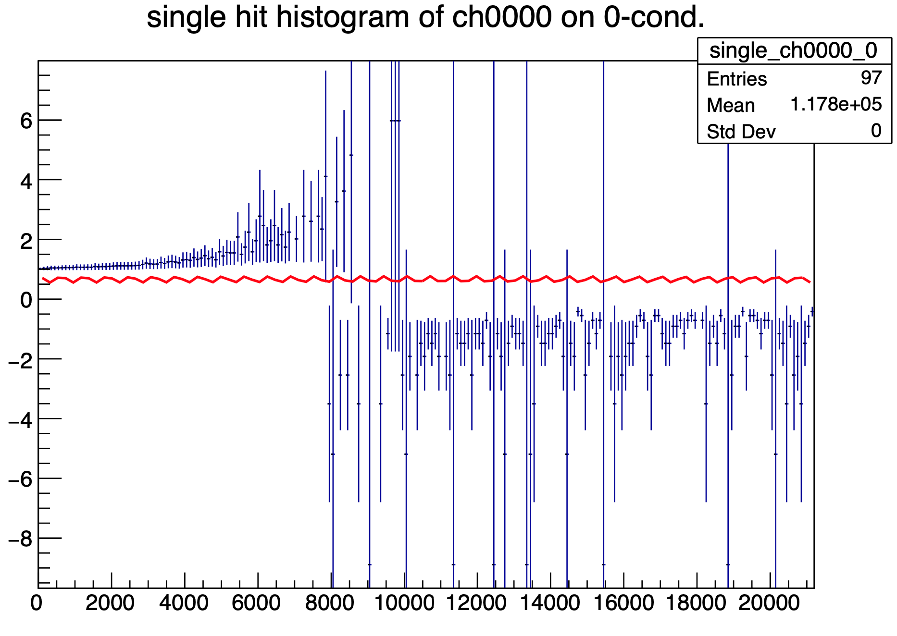
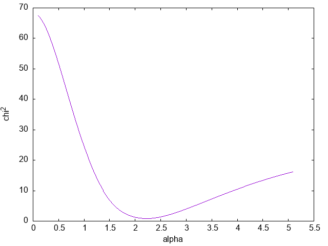
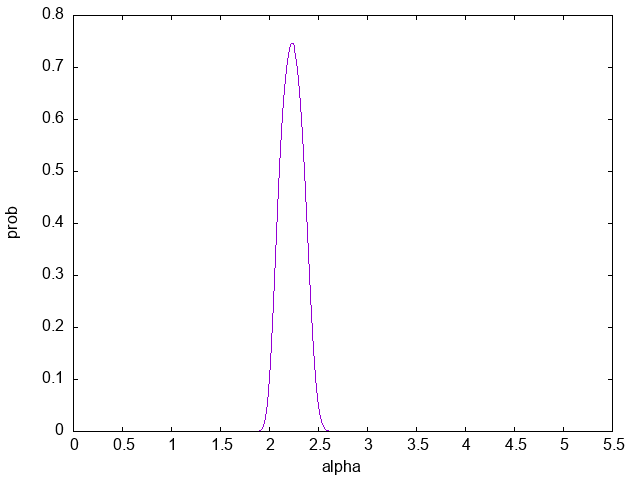
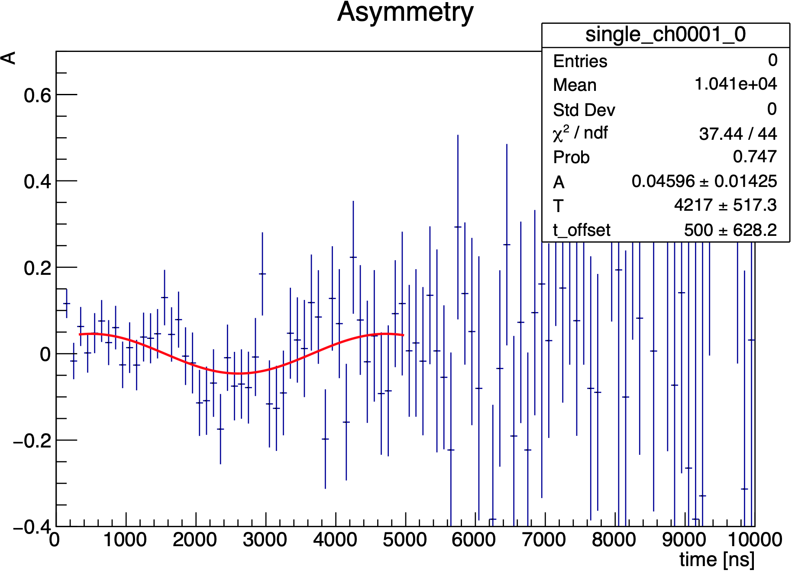

# パラメーター探索 ver.2 の提案

無制限レポート書いてる途中に、これまでの解析手法だとなんか無駄に恣意的な気がしてきたので、別手法で記載しようと個人的には考えています。
結論はほとんど変わらないのでご心配なく。
モヤっている点としては、

- 最初の exp によるフィッティングで t_offset 不要では
- 回路的には t_offset=-30 ns としているのに、t_offset をパラメトライズする意味とは
- 誤差評価って今の形式で妥当なの？

といったあたりです。
第一の点については (いつかは覚えていませんが) m_nkz が Slack で「やっぱいらない」とおっしゃっていた気がしたので割愛します。
おそらく他の方々もすぐに同意が取れると思います。

第2の点については (何度も言うとおり結論は変わりませんが)「どのパラメーターを採用するか」という解析手法に大きく影響してきそうな気がします。
この提案の趣意です。
勝手ながら槍玉にあげてみようと思います。

第3の問題点は正直自分の中で何の糸口も見つかっていないので、ボールを投げるだけにします。
レポート書いてる間に「やっぱり気になる」となった場合はしっかり検討しましょう。

## t_offset をパラメトライズする妥当性の確認

### 現状の解析手法

これまでの解析手法では

- $\alpha, t_{offset}$ の両方をパラメトライズ
- 両方動かしてフィッティングの最小値を探す
- ただし $t_{offset}=-30\:\mathrm{ns}$ に近いやつを選ぶ

としてきました。

### 白板での解析手法

解析の間に後ろのホワイトボードで議論したところによると、

- $\frac{N_U'-N_D'}{N_U'+N_D'}$ を $\frac{A-BK\cos}{B+AK\cos}$ にフィッティングさせる
- $A=N_U'-N_D', B=N_U'+N_D'$ によって $N_U', N_D'$ を求める
- $\alpha N_U'-N_D'=0$ となるように $\alpha$ を設定する
- $\frac{\alpha N_U'-N_D'}{\alpha N_U'+N_D'}$ を $\cos$ でフィッティング

という流れでした。

ただしこの方法には大問題があり、$\frac{N_U'-N_D'}{N_U'+N_D'}$ が見るも無惨な形になります。
それはそれでデータの妥当性が疑問視されてまずいんでしょうけど。
実行コードは method_whiteboard ディレクトリにテキトーに突っ込んであります。
突っ込むときに相対参照のパスを放置したので、実行するときは注意してください。



以上の問題に加えて、$\frac{N_U'-N_D'}{N_U'+N_D'}$ を $\frac{A-BK\cos}{B+AK\cos}$ に、$\frac{\alpha N_U'-N_D'}{\alpha N_U'+N_D'}$ を $\cos$ に、と2回にわたってフィッティングをするので、解析が非常にめんどくさくなります。
いや、まあ2回フィッティングするのは前のやり方でも同じなのですが、如何せん無惨なグラフから妥当性を判断して、もう1回フィッティングしてさらに妥当性を判断、ってことになると、どうしても恣意的な操作をせざるを得なくなるのではないかと危惧しています。

何が言いたいのかというと、とにかく機械的に解析できた方がいいので、うまくいっているかわからないこのやり方はビミョいよねって話です。

### 折衷案

折衷案というと聞こえが悪いですが、これまでの手法をちょっとだけ改変することで上記問題点を改善することができます。

- t_offset=-30 ns で固定
- $\alpha$ をパラメトライズしてアシンメトリーを大量に計算
- アルファと信頼度 ($\chi^2$, prob) の対応から適切な$\alpha$ を決定
- この $\alpha$ における振動数を結果とする

実際にやってみます。
お節介に思われるでしょうがBGを求めるところからやります。

<details>

<summary>BGを求める</summary>

```C
void expFit()
{
    gStyle->SetOptStat(0000);
    gStyle->SetOptFit(0000);
    gStyle->SetFuncWidth(2);

    const char *fp = "../../data/4013.root";
    TFile *file = new TFile(fp);
    TH1D *hu;
    TH1D *hd;
    TCanvas *c1 = new TCanvas("c1", "c1", 600, 600);
    file->GetObject("single_ch0000_0", hu);
    file->GetObject("single_ch0001_0", hd);
    hu->Rebin(100);
    hd->Rebin(100);

    // fitting curve
    TF1 *fu = new TF1("fu", "[0] * exp(-x / [1]) + [2]");
    TF1 *fd = new TF1("fd", "[0] * exp(-x / [1]) + [2]");
    fu->SetParameters(200.0, 2000.0, 0.0);
    fu->SetParNames("N_U", "#tau_U", "BG_U");
    fd->SetParameters(100.0, 2000.0, 0.0);
    fd->SetParNames("N_D", "#tau_D", "BG_D");
    hu->Fit("fu", "", "", 300, 20000);
    hu->SetLineWidth(2.0);
    hd->Fit("fd", "", "", 300, 20000);
    hd->SetLineWidth(2.0);

    // graph and axis label
    hu->SetTitle("Cu, Al with B 33h;time [ns];count;");
    hd->SetTitle("Cu, Al with B 33h;time [ns];count;");
    hd->Draw();
    hd->SetLineColor(kRed);
    hd->GetXaxis()->SetRangeUser(0, 20000);
    hd->GetYaxis()->SetRangeUser(0.9, 500);
    hu->Draw("same");
    hu->GetXaxis()->SetRangeUser(0, 20000);
    hu->GetYaxis()->SetRangeUser(0.9, 500);
    // y axis to log scale
    c1->SetLogy();
}
```

</details>

この結果をブチ込んで $\alpha$ ごとに $\chi^2$ と prob をリストアップします。
計算も早くなったかな？

<details>

<summary>$\alpha$ を回して $\chi^2$ と prob を出す</summary>

```C
void findPar()
{
    TH1D *h1;
    TH1D *h2;
    TH1D *h3;
    TH1D *h4;
    TH1D *h1_init;
    TH1D *h2_init;
    const char *fp = "../../../data/4013.root";
    TFile *file = new TFile(fp);
    // parameters
    int i, j, k;
    int offset = -30;
    double alpha;
    // results
    Double_t erfun;
    Double_t ndf;
    Double_t prob;
    // BGs
    const double bg_u = 6.39559e+00;
    const double bg_d = 8.27831e+00;
    // output files
    std::ofstream outputfile_chi2("param_chi2.dat");
    std::ofstream outputfile_prob("param_prob.dat");
    // hists
    file->GetObject("single_ch0000_0", h1);
    file->GetObject("single_ch0001_0", h2);
    h1_init = (TH1D *)h1->Clone();
    h2_init = (TH1D *)h2->Clone();

    for (i = 0; i < 500; i++)
    {
        alpha = 0.1 + i * 0.01;

        h1 = (TH1D *)h1_init->Clone();
        h2 = (TH1D *)h2_init->Clone();

        // move h2 left for offset
        for (k = 0; k < h2->GetXaxis()->GetNbins(); k++)
        {
            if (offset + k < 0)
            {
                h2->SetBinContent(k, 0);
            }
            else
            {
                h2->SetBinContent(k, h2_init->GetBinContent(k + offset));
            }
        }

        // rebin
        h1->Rebin(100);
        h2->Rebin(100);

        // for error evaluation
        h1->Sumw2();
        h2->Sumw2();

        // delete BGs
        for (k = 0; k < h1->GetXaxis()->GetNbins(); k++)
        {
            h1->SetBinContent(k, h1->GetBinContent(k) - bg_u);
        }
        for (k = 0; k < h2->GetXaxis()->GetNbins(); k++)
        {
            h2->SetBinContent(k, h2->GetBinContent(k) - bg_d);
        }
        h3 = (TH1D *)h1->Clone();
        h4 = (TH1D *)h2->Clone();

        // h2 times alpha
        for (k = 0; k < h2->GetXaxis()->GetNbins(); k++)
        {
            h2->SetBinContent(k,  (h4->GetBinContent(k) * alpha));
            h2->SetBinError(k, (h4->GetBinError(k) * alpha));
        }

        // D-U/D+U
        h3 = (TH1D *)h1->Clone();
        h4 = (TH1D *)h2->Clone();
        h4->Add(h3, -1);
        h2->Add(h1);
        h4->Divide(h2);

        // fitting by cos
        TF1 *f = new TF1("f", "[0] * cos(2 * TMath::Pi() * (x - [2]) / [1])");
        f->SetParNames("A", "T", "t_offset");
        f->SetParameters(.1, 3500, .0);
        f->SetParLimits(0, .01, .5);
        f->SetParLimits(1, 2500, 4500);
        f->SetParLimits(2, -500., 500.);
        h4->Fit("f", "", "", 300, 5000);

        // output chi^2/ndf and prob
        erfun = h4->GetFunction("f")->GetChisquare();
        ndf = h4->GetFunction("f")->GetNDF();
        prob = h4->GetFunction("f")->GetProb();
        outputfile_chi2 << alpha << " " << erfun / ndf << " ";
        outputfile_prob << alpha << " " << prob << " ";

        // change the lines of
        outputfile_chi2 << endl;
        outputfile_prob << endl;
    }
    outputfile_chi2.close();
    outputfile_prob.close();
}
```

</details>

リストアップしたら1次元グラフが描けるので、表示してあげましょう。
はい、どーん。





一応 gnuplot のコーディングを置いときます。

<details>

<summary>alphaによって色々グラフを描画するgnuplot</summary>

```gnuplot
set term png
set output "alpha-chi2.png"
set nokey
set xlabel "alpha"
set ylabel "chi^2"
plot "param_chi2.dat" w l

set output "alpha-prob.png"
set ylabel "prob"
plot "param_prob.dat" w l
```
</details>

$(\alpha,\chi^2)=(2.23, 0.850934), (\alpha, prob)=(2.23, 0.747049)$ が極値になっています。
素晴らしい。
ちなみに前のやり方だと$\alpha=2.24$を選んでたので、その辺も妥当なのでは。

これをもとに cos の描画まで済ませてしまいましょう。

<details>

<summary>cos描画</summary>

```C
void fitAsym()
{
    gStyle->SetOptStat(1111);
    gStyle->SetOptFit(1111);
    gStyle->SetFuncWidth(2);

    TH1D *h1;
    TH1D *h2;
    TH1D *h3;
    TH1D *h4;
    TH1D *h1_init;
    TH1D *h2_init;
    const char *fp = "../../../data/4013.root";
    TFile *file = new TFile(fp);
    // parameters
    int i;
    int offset = -30;
    double alpha = 2.23;
    // BGs
    const double bg_u = 6.39559e+00;
    const double bg_d = 8.27831e+00;
    // hists
    file->GetObject("single_ch0000_0", h1);
    file->GetObject("single_ch0001_0", h2);
    h1_init = (TH1D *)h1->Clone();
    h2_init = (TH1D *)h2->Clone();

    // move h2 left for offset
    for (i = 0; i < h2->GetXaxis()->GetNbins(); i++)
    {
        if (offset + i < 0)
        {
            h2->SetBinContent(i, 0);
        }
        else
        {
            h2->SetBinContent(i, h2_init->GetBinContent(i + offset));
        }
    }

    // rebin
    h1->Rebin(100);
    h2->Rebin(100);

    // for error evaluation
    h1->Sumw2();
    h2->Sumw2();

    // delete BGs
    for (i = 0; i < h1->GetXaxis()->GetNbins(); i++)
    {
        h1->SetBinContent(i, h1->GetBinContent(i) - bg_u);
    }
    for (i = 0; i < h2->GetXaxis()->GetNbins(); i++)
    {
        h2->SetBinContent(i, h2->GetBinContent(i) - bg_d);
    }
    h3 = (TH1D *)h1->Clone();
    h4 = (TH1D *)h2->Clone();

    // h2 times alpha
    for (i = 0; i < h2->GetXaxis()->GetNbins(); i++)
    {
        h2->SetBinContent(i, h4->GetBinContent(i) * alpha);
        h2->SetBinError(i, h4->GetBinError(i) * alpha);
    }

    // D-U/D+U
    h3 = (TH1D *)h1->Clone();
    h4 = (TH1D *)h2->Clone();
    h4->Add(h3, -1);
    h2->Add(h1);
    h4->Divide(h2);

    // fitting by cos
    TF1 *f = new TF1("f", "[0] * cos(2 * TMath::Pi() * (x - [2]) / [1])");
    f->SetParNames("A", "T", "t_offset");
    f->SetParameters(.1, 3500, .0);
    f->SetParLimits(0, .01, .5);
    f->SetParLimits(1, 2500, 4500);
    f->SetParLimits(2, -500., 500.);
    h4->Fit("f", "", "", 300, 5000);

    h4->SetTitle("Asymmetry;time [ns];A");
    h4->Draw();
    h4->GetXaxis()->SetRangeUser(0, 10000);
    h4->GetYaxis()->SetRangeUser(-.4, .7);
}
```

</details>

そして出来上がったのがこちら。



とりまここの誤差評価を盲信して磁場を計算すると、$B=1.75+0.215\:\mathrm{T}$となります。
いいんじゃないでしょうか。
